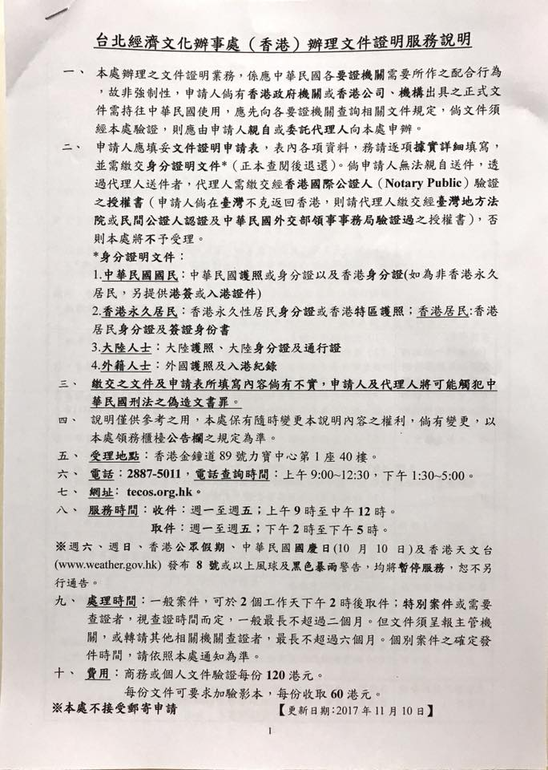

# \|\_\_ 4.1 - 畢業證件辦理

> 首先恭喜各位弟兄姊妹鄉親父老正式加入老人家行列，接下來畢業後還是有幾個大地遊戲需要大家解一下~  
> 其實這篇應該是在去年我用完就想打，不過我懶，再加上我知道會有[Ken Cheng](https://www.facebook.com/a2975667?fref=mentions)這種宇宙等級好心神人會幫大家彙整，所以就先在這簡單說一下畢業證書驗證這件事。  
> 這份是一年前的事情，是依稀記憶寫下來的，各位強者跑大地時，歡迎提出要修改的地方，造福鄉親父老。
>
> by [阿干 \(2016\)](https://www.facebook.com/groups/162461677166537/permalink/1192967024115992)

## 一、前言

如同我們的精神領袖大頭學姊所言，畢業證書如果沒有經過台北經濟文化辦事處（金鐘力寶中心一座四十樓左邊外交部櫃台）的文件認證話，回台灣是等同於廢紙的。另外，根據相關文件認證相關法規，如果之後去了第三地的外交部領事館做認證的話，會變得相當麻煩（因為還是要回香港做查證，中間還需要去啥法院作另一個申請書，非常麻煩），所以，建議拿到畢業證書後立馬拿去香港台經辦的外交部認證。

## 二、準備物品

1. 畢業證書的A4影本（記得背後也要印，正本背面右下角有序號。認證的那張貼紙，是貼在A4影本上面的。外交部阿姨表示：「因為正式的畢業證書，你也不希望因為台灣方面要用而去貼了貼紙吧？」）
2. 畢業證書正本（正本是看完就OK，拿影本去作業，所以交件當天會還你。）
3. 台灣護照或身分證（他寫或，但是依據個人應付外交部的心得，多帶絕對不會錯。）
4. 多簽本（我的情況是當時有IANG，阿姨有稍微說，如果旅遊簽的話有點麻煩，非IANG的情況需其他強者補充。另，第一年IANG好申請的程度是在港之中最簡單的一次，即使沒工作也一定會批給你，辦了絕對沒壞處，建議要辦。）
5. 申請表（[http://www.tecos.org.hk/download/authentication.pdf](https://l.facebook.com/l.php?u=http%3A%2F%2Fwww.tecos.org.hk%2Fdownload%2Fauthentication.pdf&h=ATO5t8v2-Pv8yqR_ZQxjgchxGxDam4oNV80KJErJOEDQFLkBI0SOnJigSfMkGs7Aa_bOjq1UOsOPUdadexQWT7PCY6KNaZcomEhd6UF_CcJwFb1wUb8kOhWdaQaHvIAxuZg3Ik63qU40HtrOFpc&enc=AZOUQqNkL7G-HbGQ2T6ne091h1O31W07S1GtYj6227MR8tLfYU9hCQRu-2taY-PFqElLERPQxZsLJ2a8j0lcRfzIFxGOAvvKA67rU7ELDrQKcsGJAcps0FwYOqW6yIkcvEM6ON6-RXgad89zgXpGiv11h65zEO-v5eMxjPqVnrGJrAZJm6ChyTjoe09BHjvt_kQ&s=1)）
6. HKD$120
7. 驗證授權書（交件時會給）
8. 本人（沒錯，就是要本人。非本人去，要寫一份授權書，而那份授權書需要委託人在地的法院認證（eg. 人在台灣需要台灣的法院認證；在美國要美國的法院認證），會　非　常　麻　煩，所以建議還是自己親自去一趟。
9. 學生證正影本（好像需要，待求證）

## 三、收件時間

很重要很重要很重要：一到五，9am~12pm（就是短短三小時）  
處理時間，我去年經驗約10天（含假日）

## 四、收件過程

填妥申請書後，把資料給阿姨，阿姨會幫你review一下相關資料，基本上備妥的話就沒啥問題，速度也很快（阿姨常做）。只是，因為這份文件是非彌封\*，所以阿姨還會再給你一張表格（驗證授權書），說你授權台經辦去找學校RGS查證你的是從CUHK畢業的，這張畢業證書確實是由學校發出的。表格上面大概要寫身分證（寫HKID，請強者再確認一下）、RGS的電話：3943-9888、RGS傳真：2603-5129，交件之後再給錢，拿到收據之後，等他打電話給你（代表跟學校確認完了），就可以去拿了。

補充：如果要加快，請RGS影印之後，由他們彌封後寄過去（或者是你拿著彌封的信件）給台經辦外交部直接開始認證，跳過查證這關。跳過查證這關大約可以把時間壓縮到三日後拿到。"但是"，如果你覺得你可以跟RGS溝通的話，這條路或許沒有比較快。（大家都在中大四年了，RGS跟入境處的等級應該大家認為是差不多的吧）

注意：回學校申請畢業證書影本時，RES可能會一直說：「沒有人在彌封的啦～沒這樣做的～這張蓋章影本給他們沒問題啦～那不然我多給妳個信封好了～」但是**沒有彌封會被打槍，又要回中大一次！！**所以**一定要堅持立場逼RES就範**，如果他不信就給他看說明影本第二頁。

（謝謝Hope Doong學姊親身經驗及提供以上資訊）

## 五、取件時間

一到五，下午2~5pm。有收據就可以幫忙代領，領件就相對比較簡單。

## 六、結論

**給懶得看字的人：第二大點的東西帶齊，然後本人去本人交，等十天，這樣是最沒問題的情況。**

## 七、附錄

* 郵寄：網路有寫這個辦法，但目前沒聽到相關經驗，看有沒有強者要補充。
* 心得：阿姨機掰你是正常，幫你要感恩。當你想回嘴的時候，他就會使用外交部大法：規定就是如此，你也只能乖乖閉嘴聽他的。所以強烈建議各位要用心平氣和的心情來做這件事。
* 阿對了，我在台灣使用的經驗是：請正本跟認證本都要帶著，因為台灣的承辦人通常看到認證影本都會問號
* **點上面阿干的連結可以進去看 Q&A 小編現在懶得貼。**

本條創立於2017.06.07，最後更新於2017.06.11。

