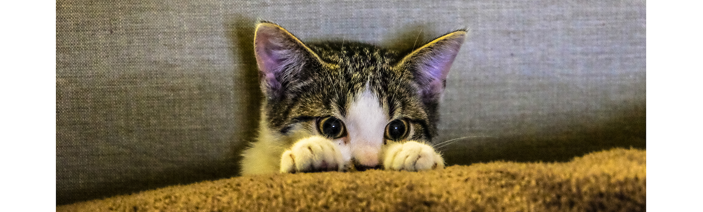
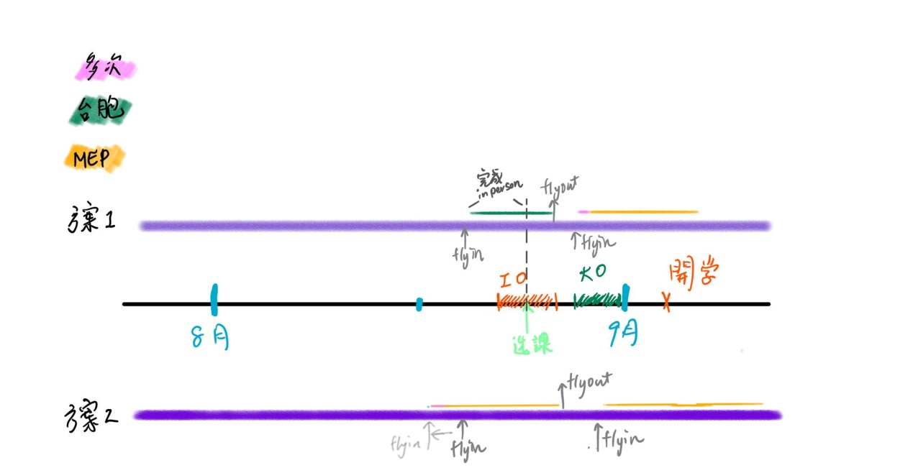
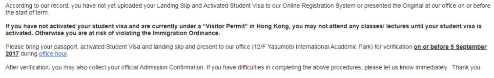

# \|\_\_ 1.2 - 簽證？身分證？

> 嗨，小編又現了。 沒錯，這裡應該是在台灣讀書和出國最大的不同，就是你必須要先有合法存留在香港的身分才能在這裡上學。這邊會稍微複雜一點點。花點耐心讀一讀，有問題可以來社團問。

很多人會聽說，來香港用台胞證就可以入境了，只可惜那是旅遊用的簽證，在香港讀書使用的**不是台胞證，**而**是學生簽證**。所以，在往後讀書的日子中，**除了第一次入境**，出入境香港你手上需要握有:

* 多次進出許可證 \(MEP，Multiple Entry Permit\) 一本小冊子
* 貼在MEP裡面的學生簽證
* 香港智能身分證\(HKID\)

> "阿那第一次呢?" 你會問。

* 你的護照
* 一張叫做 香港入境許可證 的紙 \(雖然大部分你會在email上看到它叫做學生簽證\)

## 1.2.1 香港入境許可證

記得，入境許可證**只能用一次**，而且你必須用它來"兌換" 之後進出會用到的 MEP\(多次出入境簽本，簡稱多簽本\) 和 學生簽證。

建議使用時機會是八月底來港的時候，使用後必須用它換領MEP才可以再出境。因此如果在拿到offer之後、來港開學之前想要來看看校園等等，絕對不要在這個時候用掉它！不然必須重新申請！如果IO之後、開學前想短暫回台的同鞋，會建議在開學前入港再使用，第一次可以使用港簽or台胞證。

他通常聽到會被叫成landing slip，該兌換的證件等等都兌換完之後，只需保留最近一次的入境即可，要自己貼上橘色小本本\(也可以不貼啦XD，但絕對不要弄丟\)

> 當然，如果你覺得你不常來回香港，你可以每次要來就申請一張入境許可啦，只是每次都要提前1-2個月申請，每次要花幾百塊港幣。小編個人不這麼建議。

### **申請時程**

* 入境許可證 \(就是一般新生口中的學生簽證\)：[**學校提供的連結點我。**](http://www.cuhk.edu.hk/adm/intl/uginfo17/forms/CUHK_VISA_INTL.pdf)

  * 首先感謝香港中文大學幫各位辦理集體簽證，很多學校是讓大家自己去辦。收到offer的同學約莫會在**五月初**收到中文大學簽證的e-mail，而且他會幫你檢查，所以沒有那麼恐怖。\(未滿十八歲學校會請你找在香港居住的擔保人，如果沒有認識的人現居香港，可以通知學校並請學校擔任你的擔保人，屆時學校會在寄資料到你家，並且請監護人簽名同意學校承擔其保證人\)
  * 時程：
    * 四月底五月初:        收到e-mail 完成手續
    * 七八月:             收到快遞寄發的實體許可證
    * 八月底九月初:        入境並用其辦理其它證件
  * 準備物品：
    * [ID995A](http://www.immd.gov.hk/pdforms/ID995A.pdf)
    * 掃描器或是數位相機
    * [戶籍謄本](https://www.ris.gov.tw/zh_TW/webapply/16)
    * 銀行存款證明
    * 香港監護人授權書
  * ID995A 填寫方法和疑問請轉到最下面的Q&A 這樣版面比較好看，記得回來這裡我放個你比較好找。
  * 再次提醒你，當當你快遞收到香港特別行政區政府出入境事務處所批准的出入境許可證，入境**前後**務必好好保存，此許可證只可**使用一次**。

    * 第一次進入香港時，應出示入境許可證，海關會在許可證上蓋章。
    * 入境時請將以下物品遞給海關 \(我知道我很囉唆\)
      1. 台灣護照
      2. 入境許可證

    這張入境許可證必須好好收藏，之後需憑此到灣仔出入境事務處大樓辦理多次入境許可證\(MEP並非必需品，若覺得價格太貴並且不常回臺灣，也可每次回台灣前申請入境許可證，然而申請費時一兩個月，較不建議\)。同時也憑此證辦理智能身分證\(HKID依官方規定須在1個月內辦完，有極低概率在路上被抽查\)。同時建議此張入境許可證在換妥其它證件僅備查使用，建議存放在護照套等證件夾內即可。

  

### No Objection Letter

*  記得，收到入境許可證的時候，包裹內會有一張A4紙。這張紙是允許你在校工作/打雜工，甚至是實習，的正式文件 \(它叫做 No Objection Letter NOL\)，請務必妥善保管。


> 之所以加上這條分隔線，是因為接下來的東西會是在你抵港後，到第一次離開前要去辦理 MEP 和 Visa 還有 HKID 的詳細資訊。這些東西是什麼呢?為什麼要申請呢? 請讓我們繼續看下去吧。還沒滿18歲的，往下刷一下比較好。好吧，我知道你覺得很無聊，那我再放一張貓咪的照片好了。
>
> 

## **1.2.2 -** 多次入境許可證 + 學生簽證 + 身分證

在你入港後到第一次離港前記得去辦: 香港智能身分證 + \(MEP+VISA\)

> 小編又來 murmur 了。有些人會分開辦理，有些人會選擇一起。看你的時間安排。

### A. 香港智能身分證

不要緊張，這只是香港居民智能身分證 \(HKID\)，很像台灣發給外籍人士的居留證啦。之所以先介紹他，是因為你要有他才方便你去辦很多其他的東西，舉凡辦理月租電話號碼\(俗稱上台\)、出入境、身份證明等。最重要的是，要有它才能去辦 MEP + VISA。**另外，臨時身份證與一般身份證效力相同，還有外出要戴在身上**。

初次申辦及換證皆為免費，弄丟身份證，補發費用為 335 港幣。

**申辦的方法**

* 準備物品：
  * 入境許可證 \(正反都要影印\)
  * 護照 \(影印\)
  * 申請表: [申辦時年滿18歲](http://www.immd.gov.hk/pdforms/ROP1.pdf) \| [申請時未滿18歲](http://www.immd.gov.hk/pdforms/ROP2.pdf)
  * 帥氣美麗的臉，現場拍照喔!
* 申請方法有兩種:預約 or 現場
  * **網路預約**: 必須提前至少兩周預約，**火炭** 是離學校最近的辦事處。優點是：到現場大約花20分鐘即可完成。但是開學前火炭辦事處通常人滿為患。
  * **現場排隊**: 因為每天有名額限制\(例如火炭一天80人\)，必須搭上首幾班港鐵至入境大樓排隊，才有機會領取。
  * 到了現場後: 等待唱名，現場拍攝相片\(網路相機\)，按壓指紋，並領取臨時香港身份證。
  * 未滿18歲需要在**年滿後換證**，請事先瀏覽未滿18歲申請表格，部分文件需要**父母簽名**，可事先準備。18歲過後，僅需持舊身份證、年滿18歲之申請表，即可網路預約換證。身份證號碼將不會改變，僅照片需重新拍攝。
  * 憑臨時身份證，於指定的時間到同辦事處領取。

  
^左邊是臨時身分證\(的上半部\)、右邊是正式的

### B. **多次入境許可證** MEP

Multiple Entrance Permit，簡稱MEP，俗稱橘金本、多簽本，是一本極為重要的文件。再往後的\*\*出入\*\*境的時候配合香港居民身分證使用，而非台灣護照，然非必需品，然持MEP不必於每次入境前申辦港簽並繳交簽證費用。

跟護照一樣，有使用期限，共分兩種:

* 三年 橘色的本子 980 港幣
* 一年 藍色的本子 390 港幣


### C. **學生簽證**

Student Visa，學生簽證，是允許你入境並居留的證件，_**學生簽證以貼紙方式沾黏在多次入境許可證上面**_。也就是 MEP 裡面將貼有正式的 **學生簽證** ，以及**入境記錄的紙片**，往後的日子拿到紙片請**保留最新的紙片不要丟掉**，你不知道你啥時會用到它。

* **申請時需準備物品：**

  * 香港入境許可證及影本（兩面都需印）
  * 香港居民身分證及影本（臨時香港身份證也可以）
  * 護照 及 **影本**
  * 兩吋相片 **兩張**
  * [ID931](http://www.immd.gov.hk/pdforms/ID931.pdf)
  * [ID405](http://www.immd.gov.hk/pdforms/id405.pdf)

  注意：請將文件事先影印副本，你不想在入境處印的，相信我（影印費用比學校貴好幾倍！且事先準備好文件有利專心衝刺排隊）

* **辦理方法**

  * 唯一辦理地點：灣仔出入境事務處\(需要注意他的電梯不是每台到達的樓層都一樣\)

  

  * 獲取申請資格的方法: 現場排隊：現場是有名額限制的，平日預約155位、即日195位，星期六預約30位、即日30位，2016/3月灣仔入境事務處現場公佈資料。基本上中午之前抵達都是可以辦得到的，只是因為開學期間大家都在辦，所以還是早一點去好。（禮拜六早上去的話建議衝第一班港鐵。）
  * 申請: 請抵達**五樓二號櫃臺**繳交表格並等候號碼與辦公人員核對訊息，請預留充足的時間辦理MEP，這裡需要耐心等候
  * 領取: 依照給定時間（或之後）返回灣仔出入境事務處，走至指定窗口（會寫在他最後給你的領取憑據上）投入護照及單據，並**耐心等候唱名**。再次核對資料後需至繳費櫃臺等候叫號繳費。（錢要帶夠，只接受現金/EPS）。 

## **1.2.3 - 填表 Q&A**

1. **經濟狀況中的 入息\(income\)要寫多少？** 你自己的收入/留白，寫0
2. **擬來港就讀時間？** 可以考量的點是你有沒有要參加Ocamp \(迎新\) 來決定幾號底港，還有你有沒有要提早來辦東西和手續\(但是要注意你的住宿喔!\)
3. ```text
   Ocamp: 迎新
   1. 小O（正確粵語叫: 細O) 
   是各科系的迎新,一般會落在8月15前後，一般國際學生不會去參加（太早了）但是也是可以去，有人說主要是會認識學長姐
   2. IO (international Ocamp) 國際學生會(ISA)主辦的迎新
   3. 大O: 書院Ocamp, 書院的迎新, LWS, SHHO和MC 基本是上強制參加
   ```
4. **戶籍謄本是戶口名簿麻？** 不是。[http://goo.gl/aUE1x](http://goo.gl/aUE1x)
5. **擬在港就讀時間，如果有想要修雙學位（不一定能）怎麼辦？要寫五年麻？** 延畢什麼的都是之後的事，現在發給你的是多少就是多少，之後填預計畢業日期也一樣，一直到你正式申請延畢才可以改
6. **存款金額要寫多少呢？** 說明寫 a minimum balance of HK$50,000 \(or equivalent in other currencies\) on top of the tuition and accommodation fee amount. 既然上面的單位用acedemic year 計算，請比照辦理。所以就是你入學學費 + 50,000 以上的金額都可以。
7. **學歷證明要寫到哪裡呢？怎麼寫?** 從高中開始寫，一般只需要填高中，除非你有大學學歷\(例如研究生\)以此類推
8. **簽證前來如果要去就辦觀光簽證或是用台胞證就好嗎??** 是，記得入境許可證&gt;&gt;&gt;&gt;只能用一次&lt;&lt;&lt;&lt;
9. **如果存款是家長的** 在表格右側附註即可
10. **如果有獎學金的話存款證明要多少** 如果你有拿到獎學金（已經確定金額）可以填寫其金額在"其它"那欄並附註是獎學金，和存款總和只要達到 tuition+accommodation+5W 即可 \(單位一樣是用年計算\)
11. **學歷證明怎麼填 \(我用我當初填的，非標準答案\)** major: general / Degree: high school diploma
12. **旅行證件類別寫什麼?** Passport
13. **要寄學測成績單正本嗎?** 千萬不要亂寄出正本，不見很麻煩

## **1.2.4 - 如果我開學期間左右還想回台灣......**

這是個非常複雜的問題，在此小編先建議大家除非必要，否則盡量不要在證件沒全拿到之前離開香港。 首先讓我們來回顧一下，正常狀況下，學生身分的你離開香港必須持有

1.HKID 2.MEP\(當然包括本來就黏在裡面的學生簽證、以及夾在裡面的你入境的小貼紙\)

而辦好這兩樣東西需時兩周左右，由於大部分的人會參加IO，所以假設你IO在21-25，開學日是9/3，一般大家都會選擇在這段時間去辦證件，很顯然你可能會在9/1x號才拿到這兩樣證件，在此之前並不鼓勵大家離開香港。原因是只有用學校給你那張入境許可證進入後才能是以「學生身分」去換MEP，以旅客身分進入的話是不行的，如果你用旅客身分進入，你需要之後再出入境香港一次去開通你的學生身分。

目前可能方法有這幾種

方案一: 用台胞證\(旅客身分\) 在 IO入境，入境後先去in-person registration 以防萬一，出境時用台胞證 \(旅客身分\) 出境。再次入境時用入境許可證入境\(學生身分開通\)，入境後去辦理身分證和 MEP。 缺點: 是在IO期間不能辦理電信。銀行不受影響。有選課風險但是應該不高。 優點: 最直覺。

方案二: 提早入境，用入境許可證\(學生身分開通\)，隨即馬上辦理MEP，等辦好後，往後用MEP出境。 缺點: 改機票+額外住宿費用 優點: 用錢什麼都可以解決。 

原則上，選課不因你有否使用入境許可證進入而影響。但還是在此提醒無論何種方式，請盡早開通你的學生身分，並在此提醒**所有新生**在9月初應該會收到這封信  請務必記得給學校看你的landing slip以激活！

如果有任何其他的困難或者問題導致你無法在學校給你這封信之前用入境許可證入境\(你要給學校看的是你用入境許可證之後他會給你一張小貼紙landing slip，海關會黏在入境許可證後面，他才是重點，紀錄了你用入境許可證入境的時間\)最建議的方式是直接詢問學校，一定要讓學校知道你目前的情況才能幫助你，學長姐只能告訴你過去的情況跟過去的肉身測試，但畢竟規定有可能有更動，學校才能及時了解你的狀況並給予協助。

## **1.2.5 - 學長姐辦證件心得分享**

> \(我當時\) 預約到灣仔中午的HKID。去六樓MEP辦事處看看，可能仍有剩下的Ｗalk in Quota，若備好多簽資料，依然可以立即辦妥多簽。而且多簽等到最後，大約四點半開始，趕著下班的公務員會加快腳步，使你更快得到MEP。 \(15' Annie\)
>
> HKID若採預約，到現場大約花20分鐘即可完成。改天再辦MEP，一早出去排隊約可在10點前完成。不耐久候者建議分開辦且記得**HKID要預約**。若選擇一天辦HKID+MEP，至少必須到下午甚至傍晚才能完成。 \(15' Jo-Yu An\)
>
> 等待時間極為漫長，建議學弟妹帶點東西去玩

本條創立於2017.06.07，最後更新於2018.08.01。

