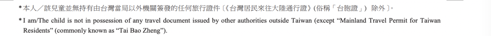

# \|\_\_ 1.2.5 - 台灣護照以外的護照

大部分的人申請中大時都是以台灣身分申請，若你有第二本護照（其他國家的護照），學校應該都會請你用台灣的護照辦理學生簽證。因此在抵港前申請的所有申請文件會和其他人一樣。

但是！抵港後辦理MEP時，要填的文件（ID931\)上面會有一項聲明：  

_翻譯：如果你**同時擁**有其他國家的護照，就不可以申請MEP。_

為什麼會有這樣的聲明呢？

因為中國大陸與台灣的複雜政治問題，導致我們不能用台灣護照進出入香港，需要用”MEP“當作出入境的工具。但是如果你已經有其他護照，便不需要辦理這樣的手續，直接利用那個護照出入境即可。

通常，提交這份申請表時，櫃檯的人員都會再尋問你一次，有沒有台灣以外其他國家的護照。

這時，如果你告訴他你有他國護照，櫃檯人員就會告訴你之後該怎麼做。

小編提醒：擁有雙重國籍的小朋友們要先上網**做好功課**喔！

以**美國**護照為例，移民局會需要你準備：

* 台灣護照及其影本
* 美國護照及其影本
* 父（母）親美國護照**影本**
* 美國出生證明**影本**
* **ID405** \(工作人員會給你）

資料準備好和填妥後，提交後支付200元港幣的費用，他們就會幫你把學生簽證從台灣籍轉成另一個國籍，並把學生簽證黏貼在你的第二本護照上。此後，你進出香港便只需要憑此護照和香港身分證即可。

