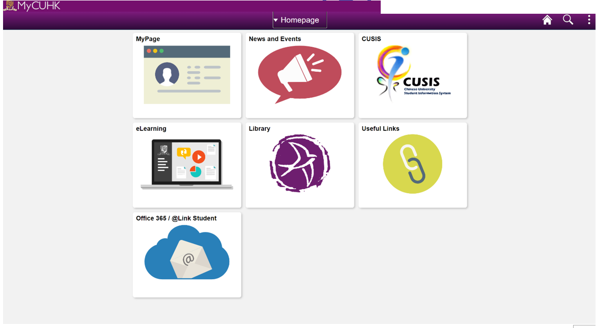
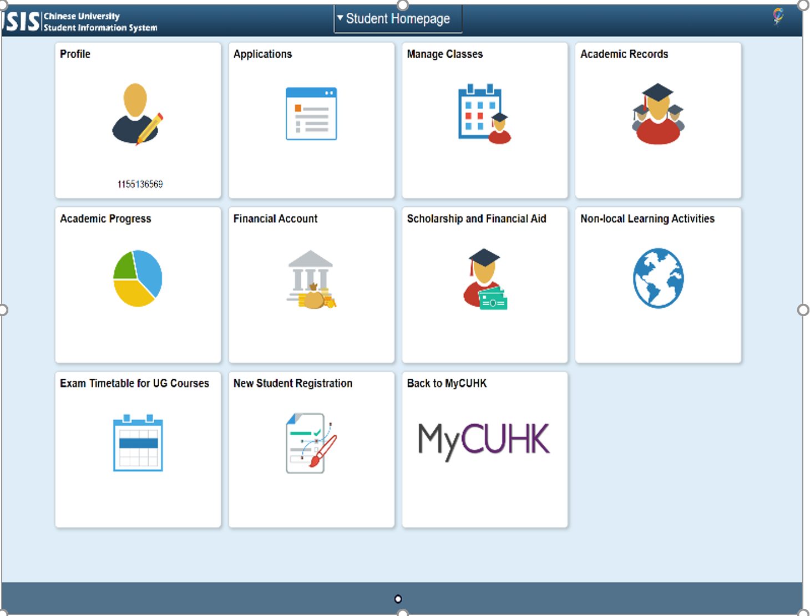

# \|\_\_ 3.1 - 好了！帳號 和 Wifi

> 想知道怎麼用中大帳號在**全世界**重點大專院校連接無線網路? 怎麼在宿舍直接列印文件? 去麥當勞和港鐵可以上網? 或是使用學校提供的 免費Microsoft Office 和 1TB的雲端硬碟? 開始囉!

## 3.1.0 有問題找誰

中大資訊科技中心服務處 \(Information Technology Service Center，ITSC\)，是在中大提供所有學生所有資訊相關服務的地方，而他的服務你每天都會使用到。ITSC 辦公室座於百萬大道上的碧秋樓。碧秋樓一樓主要是電腦機房，其中是香港國際互聯網交換中心的其中一個主要節點，可說是香港網路的源頭之一。碧秋樓二樓是提供給學生使用的電腦，亦有資訊協助站，可以解決使用者問題。

## 3.1.1 帳號

入學後你會面臨大量的帳號密碼，還有各單位用不同的名稱稱呼同意組帳號密碼的冏境。學校已經努力在統合但是成效有限，所以請耐心閱讀。

* **A. 最重要的CWEM & OnePass**

  **新生入學的時候會拿到一組帳號密碼，就是他。他的別名包含了: CWEM, Onepass, Cusis 帳密, 學校帳密。**

  * 帳號: s+學生證號碼。
  * 密碼: 有標點符號那個
  * 適用服務: CUSIS \(介紹在這篇最下面 @3.1.5\)、BlackBoard、CUHK 無線網路、CUHKa 無線網路、ResNet、保健室預約、VPN、@link 信箱、等.......。
  * 更改密碼: 登入CUSIS即可更改密碼
  * 忘記密碼: 可以[線上申請重設](https://opq.itsc.cuhk.edu.hk/que/cindex.jsp)  ，也可攜帶學生證並親自前往碧秋樓109A室或伍何曼原樓六樓學習共享空間。

* **B. 跟學生證綁在一起的 CU-LINK PIN**

  **拿學生證的時候會給你改密碼的機會，一般是一個4-8位數字**

  * 適用服務: 進出自己學系實驗室/教室、周末進出特定學校建築，刷完卡後需要輸入的密碼。
  * 忘記密碼: 親自到碧秋樓109A室、伍何曼八樓804室或伍何曼原樓六樓學習共享空間，更改密碼。

* **C. 圖書館專用的 Library Password**

  **拿學生證的時候會給你改密碼的機會，一般是一個4-8位數字**

  * 適用服務: 圖書館所有服務所使用的帳號密碼，需要[申請](https://library.cuhk.edu.hk/pinreset)
  * 此組帳號密碼可以管理借閱書籍、延長借閱期限、使用圖書館電腦、於校外網路連結圖書館服務。圖文教學[由此連結](http://www.lib.cuhk.edu.hk/Common/Reader/News/ShowNews.jsp?Nid=331&Pid=27&Cid=181)。

## 3.1.2 Wifi / 宿網

沒有網路就會很痛苦的各位同好們。打開手機上的Wifi可以收尋到這些熱點。

* CUHK : 請用 CWEM 登入，會定時登出
* CUHKa : 請用 CWEM 登入，會定時登出 \(他速度大於等於CUHK\)
* 宿舍網路 \(Resnet\) : 插入網路線 \(自備!\) 請使用CWEM 登入，會定時登出
* **不會定時**登出的Wifi : 請先使用 CWEM 帳號[申請](https://wifipartners.itsc.cuhk.edu.hk/)。可以連線:
  * Universities via xxx
  * CSL
  * Y5ZONE
  * Eduroam: 世界各重點大專院校都有，非常方便，請至[此處](https://wifipartners.itsc.cuhk.edu.hk/getting-connected-eduroam-iphone.html)跟隨教學申請
  * CUHK1x：帳號是學校給你的信箱，密碼一樣是CWEM

注意，請不要自行在宿舍隨意架設網路基地台，會被斷線。對了，記得自己帶網路線。

## 3.1.3 - 好用服務和福利!

### Office 365

* 請先於[此處](https://www.cuhk.edu.hk/o365/)登入，之後再點下右側的Install Office apps
* 自去年開始，中大與微軟合作讓同學可以免費下載使用Office 365 ProPlus。Office 365 包含了 **Word, Excel, Powerpoint, OneNote, Access, Publisher, Outlook, Lync, InfoPath** 共九個專業文書軟體。價值不斐!
* 附帶 Office 365 的事商業用 **One-Drive**。One-Drive 是由微軟開發的網路硬碟，中大學生在開始使用Office 365之後隨即獲得 1TB 的網路儲存空間。

### 信箱 @link

* 好好愛惜這個帳號，因為會讓你填寫e-mail時看起來很專業!
* @link 是 Office 365 底下的功能，也是從今年開始中大唯一提供的 e-mail 服務。所有學生的 e-mail 初始設定將會是: sid@link.cuhk.edu.hk. 而所有學校的信件一律寄送到此信箱。
* 這個@link信箱可以轉移到自己平常習慣使用的郵箱、裝置上，畢業後可申請for alumni信箱，詳細操作教學請見[此處](https://www.itsc.cuhk.edu.hk/en-gb/student-it/email-messaging-and-collaboration/link-email)

### 翻牆專用 VPN

* 連結校外網路時透過VPN使用中大僅對校內網路開放的服務 \(例如系上的登錄系統\)
* 在中國使用其翻牆
* 透過其連線到香港線上遊戲伺服器
* VPN 設定方式請

  [參考這裡](http://www.cuhk.edu.hk/itsc/chinese/network/vpn/vpn.html)

### 防毒軟體

學校免費提供\(昂貴的\)防毒軟體卡巴斯基 \(Kaspersky\)  
安裝方式請參考[怎麼安裝](https://www.cuhk.edu.hk/itsc/chinese/security/antivirus/)。

## 宿舍直接列印文件

當然，不會有人送到你家門口，但這可以省去把檔案存到USB然後開圖書館電腦再列印的時間。請再電腦安裝[無線列印設定](http://www.lib.cuhk.edu.hk/tc/use/facilities/print-copy-scan/wifi)就可以在列印時選擇圖書館的影印機了!

## 3.1.4 - 備註

ITSC 等服務皆有[系統維護時間](http://www.cuhk.edu.hk/itsc/sys_ava/maint.html)，請注意特定維護時間，避免作業來不及上傳。  
另外推薦一款協助電腦登入各是中大帳號的Chrome 套件 : [Lazy CUHK](https://chrome.google.com/webstore/detail/lazy-cuhk/hhholmpehbnebpfklecipmcpkelnnabe) 但請不要在公共電腦上使用。

## 3.1.5 - MyCUHK教學

MyCUHK是中大學生重要的管理平台，舉凡選課換課、獎學金領取、個人資料、交換申請、繳納學費，皆須透過此系統。進入網址:[點我](https://portal.cuhk.edu.hk/)。其中CUSIS將會是你最常使用到的頁面。

### 功能

1. Home
   * _**CUSIS: 這是最主要你會用的**_
   * News and Events: 基本上跟每周五收到的 "Digest of CU Mass Mails for Undergraduate Students" 是一樣的。
   * Library: 和直接到圖書館網頁一樣，而且有部分服務需要另外輸入一次帳號密碼，建議不需要繞一圈直接使用[圖書館官網](http://www.lib.cuhk.edu.hk/)。
   * MyPage: 更改密碼、預約學校場地、校醫看診預約、查詢大部行積點。
   * Office 365/@Link Student:自動連結office 365。
   * Useful Links: You must be kidding me.
2. 個性化選項: 可以調整下面想看到的內容

### CUSIS 功能介紹

**Profile** : 個人資料填寫，學校聯繫你的方式，記得要定期更新才不會收不到重要信件。

**Applications** : 各種申請表填寫\(Exemption, Transfer Credits...\)。

**Manage Classes** : 選課即查詢課程的地方，會在[3.2](32-xuan-8ab23f.md)有詳細介紹

**Academic Records** : 可以透過CUSIS 查詢成績或是申請非正式學生成績單。

**Financial Account** : 查詢學費

**Exam Timetable for UG Courses**：查詢期末考時程表

條目創立於2017.06.07，最後更新於2020.06.14。

