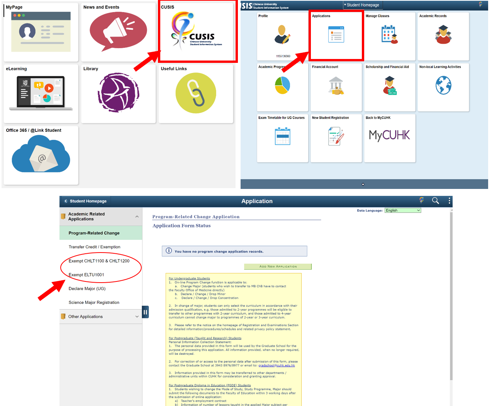
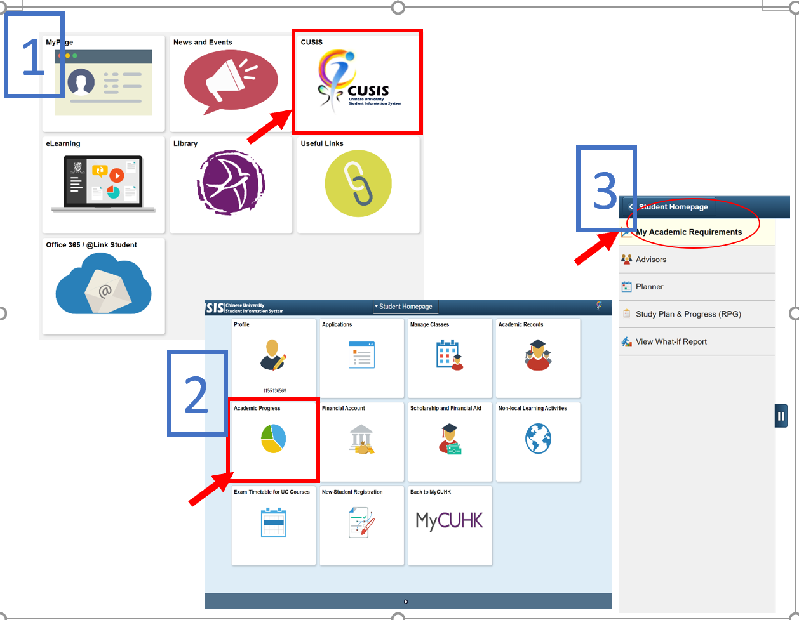
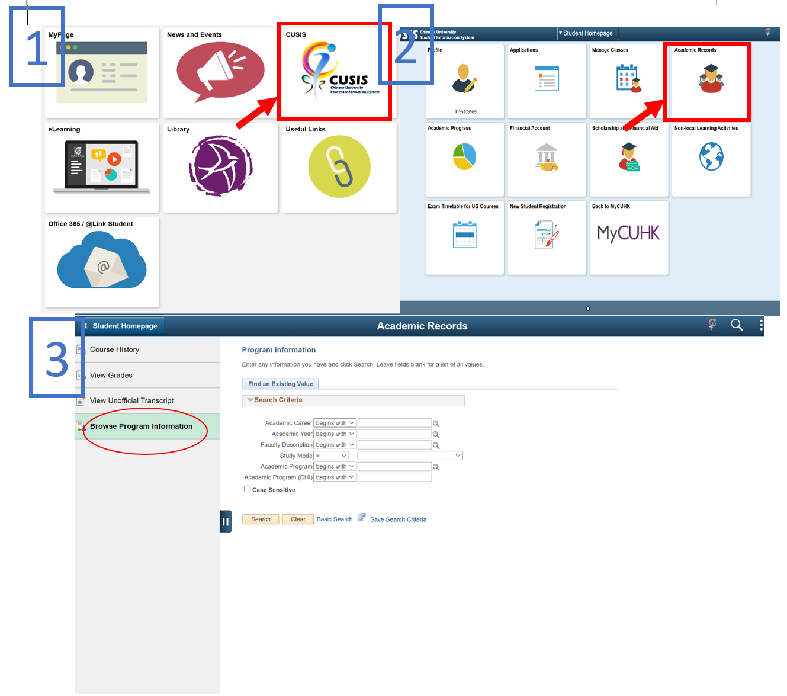

# \|\_\_ 3.2 - 選課？有關課程

## 3.2.1 - 修課要求

每學期**修課**規定上下限為：**至少 9 學分，至多 18 學分**；暑假期間最多 6 學分；每學年不超過 39 學分。為工程學院第一學年每學期上限增為19 學分。如果需要超過學分上限可以提出申請，最多可改為上限 21 學分。若要申請，應先向**主修 \(major\) 主管單位**提出要求，並在指定日期前繳交要求認可信給註冊及考試組。  
每個人的修課可以拆解成: **主修課程** + **核心課程**。有關主修的課程安排可以參考[這裡](https://cusis.cuhk.edu.hk/psc/public/EMPLOYEE/HRMS/c/CU_CUR_MENU.CU_ATCH_DISPLAY.GBL?&)的建議。手冊主要是針對核心課程給予全面性的介紹，各科系的課也可以直接詢問學長姐比較精確!

選課時間，學期開始前會收到RES寄的信詳細說明選課時間，每個年級皆不同請詳細注意。如果不小心刪了RES的信，也可以在CUSIS上面查看。

## 3.2.2 - **核心課程**

核心課程\(University Core Courses\)，為香港中文大學，主修課程之外的其它必修，其中包含: 大學中文、大學英文、通識教育、資訊科技、體育，五大項。

### 一、大學中文

大學中文 \(University Chinese\)，共六學分，分為大學中文（一）、大學中文（二），課程編號分別為 CHLT 1100 和 CHLT 1200。 大學中文會自動安排，不需自行選課，如果有申請豁免，系統會自行移除。此外，大學中文\(一\) 擋修 大學中文\(二\)。

符合下列兩者之一即可豁免 CHLT 1100 和 CHLT 1200 共六學分的大學通識：  
1. 學測 14 級分 \(含\) 以上**且**作文 A+  
2. 指考 70 分 \(含\) 以上 如要申請豁免大學中文，請依照科系於指定日期\(時間請以學校公告為主\) 內繳交：申請表、成績單正本 or 影本

### 二、大學英文

大學英文 \(University English\)，共九學分，分為大學英文（大一時修課，全校一致）、學科英語 （一）、學科英語 （二），課程編號分別為 ELTU 1001, ELTU201X 和 ELTU301X ， X 隨科系而異。大學英文會自動安排，不需自行選課，如果有申請豁免，系統會自行移除。大學英文每年似乎都有規則上微幅的調整，以學校e-mail通知為主。

不同於大學中文，大學英文的三門課中僅 ELTU 1001 可以豁免

* 符合下列任一即可豁免 ELTU 1001 共四學分的大學通識：
  * TOEFL PBT 590 \(含\)以上
  * TOEFL CBT 243 \(含\)以上
  * TOEFL IBT 96 \(含\)以上
  * IELTS 總分7.5 \(含\)以上，各科成績 7 \(含\)以上
  * 英文系學生
* 符合下列任一即可將 ELTU 1001 以一門進階英文（ELTU1002）替換：
  * TOEFL PBT 550 \(含\)以上
  * TOEFL CBT 213 \(含\)以上
  * TOEFL IBT 79 \(含\)以上
  * IELTS 總分6.5 \(含\)以上，各科成績 7 \(含\)以上

如果要申請豁免/替換，請依照科系於指定日期內繳交：豁免申請表 / 替換申請表\(CUSIS內\)、成績單 / 證書 正本or影本

####  申請表

### 三、通識教育

通識教育分為

**一、基礎通識**，兩門課皆必修：（兩門課修讀順序互不影響）

* UGFN1000（與自然對話 In Dialogue with Nature）  
* UGFH1000（與人文對話 In Dialogue with Humanity）

**二、大學通識**： 共分四大領域，每領域必須選讀一門，四門總學分需達 9 學分\(含\)以上，四領域包含：各領域課程列表請參考[這裡](http://www5.cuhk.edu.hk/oge/index.php/tc/2011-06-24-02-56-10/2011-07-06-09-36-59/2012-02-01-08-30-19)

* UGEA 中華文化傳承
* UGEB  自然、科學與科技
* UGEC  社會與文化範圍
* UGED 自我與人文

> 備註: 什麼是雙重編號?
>
> * 雙重編號指的是兩個編號共用這門課，然而一門課僅可以同時存在一個編號。 舉例來說：若有一堂UGEB1570 \(double coded with PSYC1050\) 我是一個ENGG學生 然後我想要minor PSYC\(心理學\) 我不能說我上了這堂UGEB1570 來同時滿足 PSYC minor 心理學的要求 因為它只能當作UGEB **或** PSYC
> * 雙重編號可以隨時轉換 舉例來說：修完UGEB1570 決定要minor PSYC, 可以透過申請把UGEB1570轉換成PSYC 1050 然後再補修一堂UGEB 來滿足四大領域每個領域都需要有修到的要求。
>
> 老人的小建議:  
> 通識課或許不用急著全部都在低修完。有些學長姐會留一門通識課放在最後一個學期修，以方便未來生崖規劃。背後的原因是你只要缺一門通識課，就可以延畢。

**三、書院通識**：書院通識為 六 學分，各書院通識有異，請參考各書院要求

_**注意：通識教育修課的基本規則**_

* 修讀四大領域前 需要同時或已經修完一門對話（UGFN / UGFH）
* 一學期最多可以修2門通識
* UGFH/UGFN 兩門必須要在大二上之前修完（不然學校會強迫你修，意即直接Pre-assign）
* 四大領域無法修讀與主修\(major\)相關之課程，請在選讀前仔細閱讀是否有 "Not for XXX major students."

### 四、資訊科技

一學分（ENGG1000），工程學院學生自動豁免，但須記得上網填寫免修表單。

需要另外注意的是，大部分的ENGG1000都會專門開給某個faculty，其他faculty容易被擋修，所以會建議在該學期選修。

目前CUSIS上是：

Sem 1：Business Administration, Art Sem 2：Science, Social Science, Medicine, Law, Education

### 五、體育

體育為大一強制必修，一學分，上下學期各修讀一門體育，共兩學分。體育十分搶手，為大一選課最激烈的戰場。體育課除游泳課（游泳課規定須戴黃色泳帽）外，皆須著中大體育服（上衣），短褲似乎不強制。體育服裝於開學前公告學校販售地點，請留意e-mail。

需另外注意的是，從2017-2018入學之後，體育課修課方法改為swap，也就是說你會先拿到已經enroll好的1學分體育課，但是上面不會寫你是游泳、瑜珈還是什麼。要等到開放選課後用swap的功能將這個體育課PHED1000換到你想要的課。

學校非常熱愛改來改去.....小編覺得給魚吃不如給魚桿，為了以防之後改了但我們這些老人不知道\(大一後就沒有體育啦\)，在此附上[體育課官方選課須知](http://www.peu.cuhk.edu.hk/zh-tw/pe-courses/course-selection-and-add-drop-procedures)。

因為體育課成績並不是非常好拿，所以學生會把各體育項目列出，讓新生參考自己喜歡而且比較合適的體育課程。課程男女分班，除游泳僅上學期開班，其餘皆開班，可選擇項目如下：

| 項目 | 男生標準 | 女生標準 |
| :---: | :---: | :---: |
| 田徑 | 1. 100公尺跑：11.8秒內滿分。 2. 鉛球：10.6公尺以上滿分。 3. 跳遠：5.3公尺以上滿分。 4. 標槍：30公尺以上滿分。 | 1. 100公尺跑：14.2秒內滿分。 2. 鉛球：6.62公尺以上滿分。 3. 跳遠：3.9公尺以上滿分。 4. 標槍：19.3公尺以上滿分。 |
| 游泳 | 1. 50公尺 蛙式或是自由式，測速度，分別是36秒 / 30秒滿分。 2. 25公尺 蛙式或是自由式，看姿勢 3. 前面兩項不可以是同一種姿勢 | 1. 50公尺 蛙式或是自由式，測速度，分別是44秒 / 33秒滿分。 2. 25公尺 蛙式或是自由式，看姿勢 3. 前面兩項不可以是同一種姿勢 |
| 體能鍛鍊 | 1. 1.5哩跑 \(2414.64米\)：30%，9分鐘內滿分。 2. 仰臥起坐一分鐘：15%，56次或以上滿分。 3. 引體向上 \(正握\)：15%，14次或以上滿分。 4. 坐體前伸：15%，41cm或以上滿分。  | 1. 1哩跑 \(1609米\)：30%，7‘40“內滿分。 2. 仰臥起坐一分鐘：15%，50次或以上滿分。 3. 屈臂懸垂 \(正握\)：15%，15秒或以上滿分。 4. 坐體前伸：15%，43cm或以上滿分。  |
| 籃球 | 1. 運球上籃五次，20秒內完成即為滿分。 2. 籃底投籃40秒內，投進12球即為滿分。 3. 罰球 8 球，投入7球即為滿分。  | 1. 運球上籃五次，28秒內完成即為滿分。 2. 籃底投籃40秒內，投進 9 球即為滿分。 3. 罰球 8 球，投入 5 球即為滿分。  |
| 排球 | 1. 上手向牆壁擊球，40球即為滿分，兩次機會。  2. 下手接球左右邊各四球，全部擊回中央區域為滿分。  3. 發球 5 球，女生允許上下手發球，男生只可上手發球，落點於最左後及最右後為滿分。  | 1. 上手向牆壁擊球，40球即為滿分，兩次機會。  2. 下手接球左右邊各四球，全部擊回中央區域為滿分。  3. 發球 5 球，女生允許上下手發球，男生只可上手發球，落點於最左後及最右後為滿分。  |
| 壘球 | 1. 10公尺與另一人過肩傳球，30秒內20球為滿分。 2. 五球中的四球，自拋並打擊至12公尺外即為滿分。 3. 八球投期中六球擊中11.5公尺外的靶即為滿分。  | 1. 7公尺與另一人過肩傳球，30秒內20球為滿分。 2. 五球中的四球，自拋並打擊至6公尺外即為滿分。 3. 八球投其中六球擊中9.5公尺外的靶即為滿分。  |
| 手球 | 1. 手球投擲五球，距離計分，落點在23公尺為滿分。 2. 九公尺線外射門五球，直入角落即為滿分。 3. 兩側射門，五球成功涉入指定區域即為滿分。  | 1. 手球投擲五球，距離計分，落18公尺為滿分。 2. 九公尺線外射門五球，直入角落即為滿分。 3. 兩側射門，五球成功涉入指定區域即為滿分。  |
| 足球 | 1. 運球：50呎內豎立10個標誌，「之」字型來回運球一次，20秒內滿分。 2. 12碼罰球：射球5次。 3. 傳控球：兩人一組，距離40呎，互相傳球，一球一分，滿分20。  | 1. 運球：50呎內豎立10個標誌，「之」字型來回運球一次，20秒內滿分。 2. 12碼罰球：射球5次。 3. 傳控球：兩人一組，距離40呎，互相傳球，一球一分，滿分20。  |
| 網球 | 包括正拍擊球、反拍擊球、上手發球，皆為10球取最高分8球。各佔120%（技術）＋5%（動作流暢度）  | 包括正拍擊球、反拍擊球、上手發球，皆為10球取最高分8球。各佔120%（技術）＋5%（動作流暢度）  |
| 壁球 | 1. 正手直線擊球：50秒時間，首5球每球兩分，之後每球一分，15球滿分。（男女的有效落球區域不同，男為女的一半） 2. 反手直線擊球：50秒時間，首5球每球兩分，之後每球一分，15球滿分。（男女的有效落球區域不同，男為女的一半） 3. 高吊發球：從每邊發球格發5球高吊球，依照落球位置記分。（男女落球位置所代表的分數有些微差異）  | 1. 正手直線擊球：50秒時間，首5球每球兩分，之後每球一分，15球滿分。（男女的有效落球區域不同，男為女的一半） 2. 反手直線擊球：50秒時間，首5球每球兩分，之後每球一分，15球滿分。（男女的有效落球區域不同，男為女的一半） 3. 高吊發球：從每邊發球格發5球高吊球，依照落球位置記分。（男女落球位置所代表的分數有些微差異）  |
| 羽毛球 | 1. 正手發高球：左右每邊發5球，10球取最高分8球。 2. 正手高遠球：10球取最高分8球。 3. 吊網前球：正、反手均可，10球取最高分8球。  | 1. 正手發高球：左右每邊發5球，10球取最高分8球。 2. 正手高遠球：10球取最高分8球。 3. 吊網前球：正、反手均可，10球取最高分8球。  |
| 乒乓球 | 1. 正手攻球，兩人互打，30秒內互打50球滿分。 2. 面對發球機，以一分鐘60 球的速度，輪流反擊到左 中 右的桌上，20球都成功擊中及滿分。 3. 發球：長線長線發對角球，成功擊發五球滿分。正手左側旋球，成功擊發五球滿分。  | 1. 正手攻球，兩人互打，30秒內互打40球滿分。 2. 面對發球機，以一分鐘55球的速度，輪流反擊到左右半邊的桌上，20球都成功擊中及滿分。 3. 發球：長線長線發對角球，成功擊發五球滿分。正手左側旋球，成功擊發五球滿分。  |
| 木球 |  |  |
| 射箭（選修） | 1. 18米：每輪6箭，共2輪12箭，限時4分鐘。  2. 25米：每輪6箭，共2輪12箭，限時4分鐘。  | 1. 18米：每輪6箭，共2輪12箭，限時4分鐘。  2. 25米：每輪6箭，共2輪12箭，限時4分鐘。  |

所有體育課皆有規定的考試項目及通過標準，通過標準男女有別，可在大學體育中心佈告欄參考，上課時老師也會說明。體育課開課以廣東話語言居多，但是通常會有香港同學願意協助翻譯，運氣好的話也會遇到能夠講簡單普通話、英文的體育老師。（偷偷推女老師Crystal，廣東話普通話英語三語全能而且人很好！可以試著搶搶看她的課）

體育課平常成績的20%計算方式如下：

**出席率：12％** : 如果有特殊請假理由，教授會斟酌處理。

**課外體育活動：8％** : 每一個課外體育活動加4%，例如：

* 大步行
* 成為／身為校隊或院隊成員
* 比賽或活動  i.e.籃球錦標賽、體育攝影比賽、體育講座、觀賽心得報告
* 當體育比賽或活動的helper  i.e.攝影師、救生員

由於每學期競賽時間與競賽內容不盡相同，可至[學校體育部官方網站](http://www.peu.cuhk.edu.hk/zh-tw/) 查詢最官方的資訊，請點選體育課程中的體育課程活動分認可項目，不論是大學、書院或體育部活動都可以唷～

## 3.2.3 - 學術誠信 ＆ Veriguide

Veriguide \(維誠\) 是中大的學術誠信檢測系統，學術誠信的定義就是作業內容必須維持原創精神，不得再未引用的前提下將他人的創作寫入作業和作品當中。大多數的中大作業完成後會要求輸入 [Veriguide系統](https://academic.veriguide.org/academic/login_CUHK.jspx) 備查，並繳交簽名回饋單。

## 3.2.4 - 停課

中大除了假日及特別活動外，停課源由多為颱風來襲，只要[香港天文台](http://www.hko.gov.hk/contentc.htm)公告**八號風球或黑色暴雨警戒**，即會在對應的時間範圍內即停課，港鐵亦會暫停營運。

## 3.2.5 - 怎麼查詢 Major Requirement

大家一定都非常困惑自己究竟該選什麼課吧？到底我的的必修課跟選修課會是什麼呢！這一切在CUSIS上都可以查到唷！ 首先先打開MYCUHK點入CUSIS ，在剛進來的頁面中，點Academic Progress。進入後左欄選取My Academic Requirements。 接著就會跑出你所有的requirements，包括通識和你的program的requirements等等。

 另外一個方法，如果想更進一步知道有關你的program的詳情的，也可以在CUSIS方格介面中的Academic Records中查到。點進去後，左欄選取Browse Program Information。輸入完搜索條件，即可得到一整串的requirements囉！ 

## 3.2.6 - 如果我想minor.......?

如果有minor的想法，一般來說會要求在它所指定的課程中，修滿18credits，那麼如何知道我想minor的program，有哪些指定課程呢？ 其實跟上面的方法非常類似，只要點開Browse Program Information，選擇自己想minor的program進行查詢就好了，通常minor的標準在最下方，以Computer Science為例，他的program information拉到最下方就是minor標準。

## 3.2.7 - 怎麼查詢 Concentration Requirement

許多人（尤其是IBBA）常常面臨「不知道自己修完concentration requirement了沒」的問題，這節要教大家使用CUSIS上小工具 —— what-if report來查詢自己該修些什麼課！

首先進入CUSIS，在左側列表找到what-if report。按下create new report。

接著在自己的major下面選擇Concentration（此處以IBBA做簡介）

選好之後按下submit request。 接著就會跑出和academic requirement一樣的頁面，不同的是拉到最下面可以看到有了concentration requirement。

concentration course \(i\) 是該concentration的必修列表，可以看到列表內只有三門課，寫明了3 Required，3 taken代表你已經修完（綠色勾勾是已經修完、黃色三角形是當學期正在修課），如果沒有修完的話會看到x needed的x&gt;0。

concentration \(ii\) 列表中有兩門課，但是只有1 required，意思是列表中兩堂要選修一堂。

concentration \(iii\) 列表中有數門課，但是只有1 required，所以這欄就是那個concentration的elective，上完需要的課程數目就可以了。

## 3.2.8 - 選課教學

上述有了這麼多教學，想必大家對於自己要選什麼課也有了一些初步的想法。那麼要如何選課呢？ 首先可以在Teaching Timetable by Subject/Department裡面搜尋自己有興趣的課程代碼，會跑出來一整列詳細的資訊，相較於直接search比較容易比較老師，時間，以及最重要的是要注意語言，C是Cantonese P是Putonhua E是English。以下我們以UGFH為例。

 

按下Search後，就會出現一長串的本學期開課資訊囉。

上述方法，如果用My Class Schedule中的Search一樣可以查詢到課程資訊，如下圖，但必須一頁頁翻，相對不方便\(新生請注意，課程不是只有開三堂，可以翻頁的唷！這是來自小編的血淚經驗.....\)。

另外附帶一提的是，有些課在你enroll後會發生明明有available seats卻不讓你進的情況，可以在選課前事先Teaching Timetable by Subject/Department 的quota點進去看\(如果他是藍色的可以讓你點\)，可以得知該課reserve了幾個位子，是給那些資格的人，評估有沒有可能等到，再做e-add&drop的計畫。

另外，CUSIS在系統升級之後，為了避免系統擁擠，對於某些熱門的課，會先把學生放在Wait list上面，等到系統高峰期過了，才慢慢把學生放進course list。 例如：某課有5個vacancy，有11個學生在選課當下選了某課，系統會把學生一路排在wait list 1~11，等到系統比較不擁擠時，再把前5位補進去，6~11位放在wait list 1~6。所以**選課時如果一時沒選進自己想上的課，但是看到還有vacancy，千萬別急著drop去改選別的**！！

將想要的課程看好後，點選My Class Schedule，再點選enroll。就可將他放入shopping cart，開放選課前記得validate，看看是否有資格不符的課或者衝堂，開放選課後可以選擇enroll或者plan裡面proceed 兩者主要差別在於enroll是把shopping cart全部的東西enroll ，plan則是可以勾選，不會全部把表上的東西enroll\(當然，你可以全勾\)。

輸入class number以後就會跑出下列狀況，按next以繼續進行。\(如果在瀏覽課程時，就已確定了有要選擇的特定課程，可以直接點下去那堂課藍色的連結，可以加入shopping cart。但因為大部分時候還要為所有的courses排時間，所以會一次抄很多同個course但不同時段的class number，排好時間確認好以後再放入shopping cart\)

記得勾選wait list if class is full唷！不然不會進wait list的。

另外，若有在wait list中，可以在enroll中的my class schedule裡面看到自己的wait list position。 接著可以在Timetable Planner看到自己暫時的時間表。 接下來就是等待時間到，然後點下enroll啦！ 祝福大家選課順利！\(CUSIS每學期選課的時候當機是很正常的.....\)

如果問完學長姐建議，看過你的requirements，對於選課還是好困惑好困惑，到底哪個教授好！？給分標準如何？這些見仁見智，小編無法給予一個標準答案，但建議大家可以上[regcourse](http://regcourse.com) 或高登看看，有許多香港人會在上面給予評價。\(小編沒用過高登，他算是一個蠻大的討論區，但相對就不見得都是有關course的\)

本條創立於2017.06.07，最後更新於2018.08.08。 /\#需補充更新木球，極歡迎新生投稿\(老人沒有體育課\)\#/

